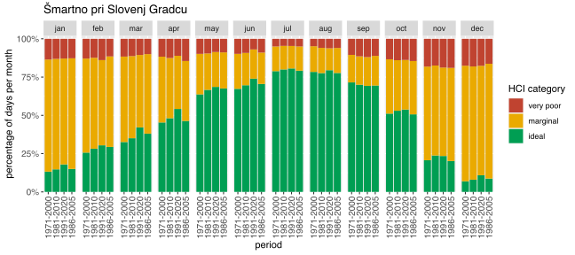

ARSO-CIT-HCI
================

## Libraries and functions

``` r
library(ggplot2)
library(readr)
library(tidyr)
library(dplyr)
```

    ## 
    ## Attaching package: 'dplyr'

    ## The following objects are masked from 'package:stats':
    ## 
    ##     filter, lag

    ## The following objects are masked from 'package:base':
    ## 
    ##     intersect, setdiff, setequal, union

``` r
library(purrr)
library(lubridate)
```

    ## 
    ## Attaching package: 'lubridate'

    ## The following objects are masked from 'package:base':
    ## 
    ##     date, intersect, setdiff, union

``` r
options(dplyr.summarise.inform=F)
```

Define constants:

``` r
periods <- c("1971-2000", "1981-2010", "1991-2020", "1986-2005")
month_names <- c("jan", "feb", "mar", "apr", "may", "jun", "jul", "aug", "sep", "oct", "nov", "dec")
station_names <- c("Rateče", "Bilje", "Portorož", "Ljubljana - Bežigrad", "Novo mesto", "Celje", "Šmartno pri Slovenj Gradcu", "Maribor", "Murska Sobota - Rakičan")
h = 0.008 # thickness of clothing [cm]
M = 25 # metabolic rate [cal/s]
A = 0.45 # albedo
```

ASHRAE scale from skin temperature. See
[CDS](https://cds.climate.copernicus.eu/cdsapp#!/dataset/sis-tourism-climate-suitability-indicators?tab=doc).

``` r
ashrae_scale <- function(skintemp, ...) { # scores have been shifted to go from 0 to 9
    if (skintemp > 35.5) {
        return (9)
    } else if (skintemp > 34.5 & skintemp <= 35.5) {
        return (8)
    } else if (skintemp > 33.5 & skintemp <= 34.5) {
        return (7)
    } else if (skintemp > 32.5 & skintemp <= 33.5) {
        return (6)
    } else if (skintemp > 31.0 & skintemp <= 32.5) {
        return (5)
    } else if (skintemp > 29.0 & skintemp <= 31.0) {
        return (4)
    } else if (skintemp > 26.0 & skintemp <= 29.0) {
        return (3)
    } else if (skintemp > 21.0 & skintemp <= 26.0) {
        return (2)
    } else if (skintemp <= 21.0) {
        return (1)
    } else {
        return (9999)
    }
}
```

CIT lookup table. See
[CDS](https://cds.climate.copernicus.eu/cdsapp#!/dataset/sis-tourism-climate-suitability-indicators?tab=doc)
and (De Freitas et al., 2008).

``` r
# list of cit values for each limiting condition (cloud cover, rain, wind) and ashrae value, see CDS docs
cloudlesslist <- c(0, 0, 0, 4, 5, 6, 7, 6, 4)
cloudmorelist <- c(0, 0, 0, 3, 3, 4, 5, 5, 3)
rainlist <- c(0, 0, 0, 1, 1, 1, 2, 2, 2)
windlist <- c(0, 0, 0, 2, 2, 4, 4, 4, 3)

cittable <- function(ashrae, cloudcover, precip, wind) {
    if (precip > 3.0) {
        return (rainlist[ashrae]) # rain overrides all other facets
    }
    
    if (wind >= 6) {
        return (windlist[ashrae]) # wind overrides cloud cover
    }
    
    if (cloudcover <= 50) {
        return (cloudlesslist[ashrae])
    } else {
        return (cloudmorelist[ashrae])
    }
}
```

HCI effective temperature rating. See Table 3 in (Scott et al., 2016).

``` r
efftemprating <- function(efftemp) {
    if (efftemp >= 39) {
        return (0)
    } else if (efftemp >= 36.5 & efftemp < 39) {
        return (2)
    } else if (efftemp >= 34.5 & efftemp < 36.5) {
        return (4)
    } else if (efftemp >= 32.5 & efftemp < 34.5) {
        return (5)
    } else if (efftemp >= 30.5 & efftemp < 32.5) {
        return (6)
    } else if (efftemp >= 28.5 & efftemp < 30.5) {
        return (7)
    } else if (efftemp >= 26.5 & efftemp < 28.5) {
        return (8)
    } else if (efftemp >= 25.5 & efftemp < 26.5) {
        return (9)
    } else if (efftemp >= 22.5 & efftemp < 25.5) {
        return (10)
    } else if (efftemp >= 19.5 & efftemp < 22.5) {
        return (9)
    } else if (efftemp >= 17.5 & efftemp < 19.5) {
        return (7)
    } else if (efftemp >= 14.5 & efftemp < 17.5) {
        return (6)
    } else if (efftemp >= 10.5 & efftemp < 14.5) {
        return (5)
    } else if (efftemp >= 6.5 & efftemp < 10.5) {
        return (4)
    } else if (efftemp >= -0.5 & efftemp < 6.5) {
        return (3)
    } else if (efftemp > -6 & efftemp < -0.5) {
        return (2)
    } else if (efftemp <= -6) {
        return (1)
    } else {
        return (9999)
    }
}
```

HCI cloud rating. See Table 4 in(Scott et al., 2016).

``` r
cloudrating <- function(cloudcover) {
    if (cloudcover >= 11 & cloudcover <= 20) {
        return (10)
    } else if ((cloudcover >= 1 & cloudcover <= 10) | (cloudcover >= 21 & cloudcover <= 30)) {
        return (9)
    } else if ((cloudcover == 0) | (cloudcover >= 31 & cloudcover <= 40)) {
        return (8)
    } else if (cloudcover >= 41 & cloudcover <= 50) {
        return (7)
    } else if (cloudcover >= 51 & cloudcover <= 60) {
        return (6)
    } else if (cloudcover >= 61 & cloudcover <= 70) {
        return (5)
    } else if (cloudcover >= 71 & cloudcover <= 80) {
        return (4)
    } else if (cloudcover >= 81 & cloudcover <= 90) {
        return (3)
    } else if (cloudcover >= 91 & cloudcover <= 99) {
        return (2)
    } else if (cloudcover == 100) {
        return (1)
    } else {
        return (9999)
    }
}
```

HCI precipitation rating. See Table 5 in (Scott et al., 2016).

``` r
preciprating <- function(precip) {
    if (precip == 0) {
         return (10)
    } else if (precip > 0 & precip < 3) {
        return (9)
    } else if (precip >= 3 & precip <= 5.99) {
        return (8)
    } else if (precip >= 6 & precip <= 8.99) {
        return (5)
    } else if (precip >= 9 & precip <= 12) {
        return (2)
    } else if (precip > 12 & precip <= 25) {
        return (0)
    } else if (precip > 25) {
        return (-1)
    } else {
        return (9999)
    }
}
```

HCI wind rating. See Table 6 in (Scott et al., 2016).

``` r
windrating <- function(wind) {
    wind <- wind * 3.6 # convert wind from m/s to km/h
    
    if (wind > 0.5 & wind <= 9.5) {
        return (10)
    } else if (wind > 9.5 & wind <= 19.5) {
        return (9)
    } else if ((wind <= 0.5) | (wind > 19.5 & wind <= 29.5)) {
        return (8)
    } else if (wind > 29.5 & wind <= 39.5) {
        return (6)
    } else if (wind > 39.5 & wind <= 49.5) {
        return (3)
    } else if (wind > 49.5 & wind <= 70) {
        return (0)
    } else if (wind > 70) {
        return (-10)
    } else {
        return (9999)
    }
} 
```

## Importing data

Wind is in m/s, Tmax in degC, cloud cover in %, precipitation in mm and
relative humidity in %.

``` r
import_daily_data <- function(station_name) {
    data <- read_csv(paste0("../data/arso-cit-hci/daily/", gsub(" ", "_", station_name), ".txt"), col_names=c("station_id", "station_name", "date", "Tmax", "avgwind", "cloudcover", "precip"), skip=1, col_types = c("c", "c", "D", "d", "d", "i", "d")) %>% drop_na()
    return (data)
}
```

``` r
import_RH_data <- function(station_name) {
    data <- read_csv(paste0("../data/arso-cit-hci/RH/RH-", gsub(" ", "_", station_name), ".txt"), col_names=c("station_id", "station_name", "datetime", "RH"), skip=1, col_types = c("c", "c", "D", "i")) %>% drop_na()
}
```

## Process data, calculate indexes

Prepare daily data:

``` r
prepare_daily_data <- function(rawdata) {
    prepared_data <- rawdata %>%
        mutate(precip = lead(precip)) %>% # move precip values one row higher
        mutate(month = month(ymd(date)), year = year(ymd(date))) %>% # extract month and year
        mutate(avgwind = if_else(avgwind >= 0, avgwind, -avgwind)) # replace negative wind values with positive values

    return (prepared_data[1:nrow(prepared_data)-1,]) # drop last row (with NA precip)
}
```

Prepare relative humidity data at 14.00:

``` r
prepare_RH_data <- function(rawRHdata) {
    prepared_RH_data <- rawRHdata %>%
        mutate(hour = hour(ymd_hms(datetime)),
               date = date(ymd_hms(datetime))) %>%
        filter(hour == 14) %>%
        select(-hour, -station_id, -station_name, -datetime)
    
    return (prepared_RH_data)
}
```

Calculate skin temperature, ashrae score and CIT:

``` r
calculate_cit <- function(index_data) {
    index_data <- index_data %>%
        mutate(skintemp = Tmax + h * M / 7 + (M - 15 + 120 * (1 - cloudcover / 100) * (1 - A)) / (2 + 9 * sqrt(0.1 + avgwind))) %>% # calculate skin temperature
        rowwise() %>%
        mutate(ashrae = ashrae_scale(skintemp),
               cit = cittable(ashrae, cloudcover, precip, avgwind)) # calculate ashrae score from skin temp, then calculate cit
    
    return(index_data)
}
```

Join relative humidity and daily datasets, calculate effective
temperature and HCI from facet scores.

``` r
calculate_hci <- function(RH_data, daily_data) {
    index_data <- inner_join(RH_data, daily_data, by="date") # join daily and RH dataframes, drop any rows with NA
    
    index_data <- index_data %>%
        mutate(efftemp = Tmax - 0.4 * (Tmax - 10) * (1 - RH / 100)) %>%
        rowwise() %>%
        mutate(hci = 4 * efftemprating(efftemp) + 2 * cloudrating(cloudcover) + 3 * preciprating(precip) + windrating(avgwind)) # calculate effective temperature, then calculate hci
    
    return (index_data)
}
```

## Aggregating data

Split data into periods and join them with relevant columns, add period
column:

``` r
assemble_cit_data <- function(index_data) {
    period_data <- data.frame(matrix(nrow=0, ncol=4))

    period1 <- filter(index_data, year >= 1971 & year <= 2000)
    period2 <- filter(index_data, year >= 1981 & year <= 2010)
    period3 <- filter(index_data, year >= 1991 & year <= 2020)
    period4 <- filter(index_data, year >= 1986 & year <= 2005)
    
    periodlist <- list(period1, period2, period3, period4)

    for (i in 1:length(periodlist)) {
        period_data <- rbind(period_data, data.frame(
            station_name = periodlist[[i]]$station_name,
            period = rep(periods[i], nrow(periodlist[[i]])),
            year = periodlist[[i]]$year,
            month = month_names[periodlist[[i]]$month],
            cit = periodlist[[i]]$cit
        ))
    }
    
    return (period_data)
}
```

``` r
assemble_hci_data <- function(index_data) {
    period_data <- data.frame(matrix(nrow=0, ncol=4))

    period1 <- filter(index_data, year >= 1971 & year <= 2000)
    period2 <- filter(index_data, year >= 1981 & year <= 2010)
    period3 <- filter(index_data, year >= 1991 & year <= 2020)
    period4 <- filter(index_data, year >= 1986 & year <= 2005)
    
    periodlist <- list(period1, period2, period3, period4)

    for (i in 1:length(periodlist)) {
        period_data <- rbind(period_data, data.frame(
            station_name = periodlist[[i]]$station_name,
            period = rep(periods[i], nrow(periodlist[[i]])),
            year = periodlist[[i]]$year,
            month = month_names[periodlist[[i]]$month],
            hci = periodlist[[i]]$hci
        ))
    }
    
    return (period_data)
}
```

Calculate number of days in each CIT category, set category and month
names:

``` r
aggregate_cit_data <- function(period_data) {
    agg_data <- period_data %>%
        mutate(
            cit_category = case_when(
                cit >= 5 ~ "ideal",
                cit == 4 ~ "marginal",
                cit <= 3 ~ "very poor"
            )
        ) %>%
        group_by(period, month, cit_category) %>%
        summarise(count = n()) %>%
        ungroup() %>%
        group_by(period, month) %>%
        mutate(percentage = count / sum(count))

    agg_data$period <- factor(agg_data$period, levels=periods)
    agg_data$cit_category <- factor(agg_data$cit_category, levels=c("very poor", "marginal", "ideal"))
    agg_data$month <- factor(agg_data$month, levels=month_names)
    
    return(agg_data)
}
```

Calculate number of days in each HCI category, set category and month
names:

``` r
aggregate_hci_data <- function(period_data) {
    agg_data <- period_data %>%
        mutate(
            hci_category = case_when(
                hci >= 70 ~ "ideal",
                hci >= 50 & hci < 70 ~ "marginal",
                hci < 50 ~ "very poor"
            )
        ) %>%
        group_by(period, month, hci_category) %>%
        summarise(count = n()) %>%
        ungroup() %>%
        group_by(period, month) %>%
        mutate(percentage = count / sum(count))

    agg_data$period <- factor(agg_data$period, levels=periods)
    agg_data$hci_category <- factor(agg_data$hci_category, levels=c("very poor", "marginal", "ideal"))
    agg_data$month <- factor(agg_data$month, levels=month_names)
    
    return(agg_data)
}
```

## Plots

A function to plot CIT data for one station:

``` r
plot_cit_data <- function(agg_data, station_name) {
    p <- ggplot(data=agg_data,
                mapping=aes(x=period, y=percentage, fill=cit_category)) +
        geom_col() +
        facet_grid(~ month) +
        scale_y_continuous(expand = expansion(mult = c(0, 0.02)), labels = scales::percent_format(accuracy = 1)) +
        guides(x = guide_axis(angle = 90)) +
        labs(title=station_name, fill="CIT category") +
        xlab("period") +
        ylab("percentage of days per month") +
        scale_fill_manual(values = c("#C04330", "#EAAA00", "#009E53")) +
        theme(axis.text.x = element_text(size = 10), axis.text.y = element_text(size=10))
    
    return (p)
}
```

A function to plot HCI data for one station:

``` r
plot_hci_data <- function(agg_data, station_name) {
    p <- ggplot(data=agg_data,
                mapping=aes(x=period, y=percentage, fill=hci_category)) +
        geom_col() +
        facet_grid(~ month) +
        scale_y_continuous(expand = expansion(mult = c(0, 0.02)), labels = scales::percent_format(accuracy = 1)) +
        guides(x = guide_axis(angle = 90)) +
        labs(title=station_name, fill="HCI category") +
        xlab("period") +
        ylab("percentage of days per month") +
        scale_fill_manual(values = c("#C04330", "#EAAA00", "#009E53")) +
        theme(axis.text.x = element_text(size = 10), axis.text.y = element_text(size=10))
    
    return (p)
}
```

Plot CIT data for all stations:

``` r
for (station_name in station_names) {
    data <- import_daily_data(station_name) %>%
        prepare_daily_data() %>%
        calculate_cit() %>%
        assemble_cit_data() %>%
        aggregate_cit_data()
    
    p <- plot_cit_data(data, station_name)
    
    print(p)
}
```

<!-- --><!-- --><!-- --><!-- --><!-- --><!-- --><!-- --><!-- --><!-- -->

Plot HCI data for all stations:

``` r
for (station_name in station_names) {
    data <- calculate_hci(
        prepare_RH_data(
            import_RH_data(station_name)), 
        prepare_daily_data(
            import_daily_data(station_name))) %>%
        assemble_hci_data() %>%
        aggregate_hci_data()
    
    p <- plot_hci_data(data, station_name)
    
    print(p)
}
```

<!-- --><!-- --><!-- --><!-- --><!-- --><!-- --><!-- --><!-- --><!-- -->

Save all the plots:

``` r
for (station_name in (station_names)) {
    print(station_name)
    
    data <- import_daily_data(station_name) %>%
        prepare_daily_data() %>%
        calculate_cit() %>%
        assemble_cit_data() %>%
        aggregate_cit_data()
    
    p <- plot_cit_data(data, station_name)
    
    ggsave(paste("arso-CIT_", gsub(" ", "_", station_name), ".pdf", sep=""), p, width=9, height=4, units="in", path="../output/pdf/arso-CIT", device=cairo_pdf)
    ggsave(paste("arso-CIT_", gsub(" ", "_", station_name), ".eps", sep=""), p, width=9, height=4, units="in", path="../output/eps/arso-CIT", device=cairo_ps)
    ggsave(paste("arso-CIT_", gsub(" ", "_", station_name), ".svg", sep=""), p, width=9, height=4, units="in", path="../output/svg/arso-CIT")
    ggsave(paste("arso-CIT_", gsub(" ", "_", station_name), ".png", sep=""), p, width=9, height=4, units="in", path="../output/png/arso-CIT", dpi=500)
}
```

``` r
for (station_name in (station_names)) {
    print(station_name)
    
    data <- calculate_hci(
        prepare_RH_data(
            import_RH_data(station_name)), 
        prepare_daily_data(
            import_daily_data(station_name))) %>%
        assemble_hci_data() %>%
        aggregate_hci_data()
    
    p <- plot_hci_data(data, station_name)
    
    ggsave(paste("arso-HCI_", gsub(" ", "_", station_name), ".pdf", sep=""), p, width=9, height=4, units="in", path="../output/pdf/arso-HCI", device=cairo_pdf)
    ggsave(paste("arso-HCI_", gsub(" ", "_", station_name), ".eps", sep=""), p, width=9, height=4, units="in", path="../output/eps/arso-HCI", device=cairo_ps)
    ggsave(paste("arso-HCI_", gsub(" ", "_", station_name), ".svg", sep=""), p, width=9, height=4, units="in", path="../output/svg/arso-HCI")
    ggsave(paste("arso-HCI_", gsub(" ", "_", station_name), ".png", sep=""), p, width=9, height=4, units="in", path="../output/png/arso-HCI", dpi=500)
}
```
