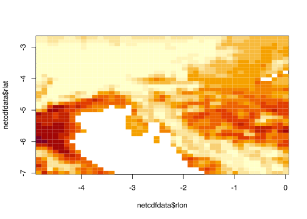
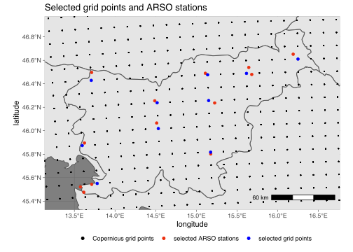

CIT-HCI-gridpoints
================

We need the coordinates of the model’s grid (near the locations we are
interested in) to extract data from netcdf files.

## Importing libraries and data

Import libraries and source functions from `processing/common.R`:

``` r
source("common.R", local = knitr::knit_global())
```

    ## 
    ## Attaching package: 'dplyr'

    ## The following objects are masked from 'package:stats':
    ## 
    ##     filter, lag

    ## The following objects are masked from 'package:base':
    ## 
    ##     intersect, setdiff, setequal, union

``` r
library(ggplot2)
library(sf)
```

    ## Linking to GEOS 3.9.1, GDAL 3.4.0, PROJ 8.1.1; sf_use_s2() is TRUE

``` r
library(rnaturalearth)
```

Load country shape data for maps:

``` r
mapdata <- ne_load(scale = 10, type = 'countries', category = 'cultural', returnclass = "sf", destdir = "geodata")
```

    ## OGR data source with driver: ESRI Shapefile 
    ## Source: "/Users/rokuk/Documents/Work/BFUL/Turizem-projekcije/R/geodata", layer: "ne_10m_admin_0_countries"
    ## with 258 features
    ## It has 161 fields
    ## Integer64 fields read as strings:  NE_ID

``` r
# map data can be redownloaded to the geodata folder using:
# mapdata <- ne_download(scale = 10, type = 'countries', category = 'cultural', returnclass = "sf", destdir = "geodata")
```

Read one file to get the model’s grid:

``` r
netcdfdata <- readcdf("../data/CIT/RCP4.5/mean/C3S422Lot2TEC_day-fair-cit-month-proj_mean_monthly_2021_2040_v1.nc", "day-fair-cit-month-proj")
grid <- transform_coords(netcdfdata)
```

Plot june data centered on Slovenia, to check if we have selected the
right rlon, rlat range:

``` r
image(netcdfdata$rlon, netcdfdata$rlat, netcdfdata$data[,,6])
```

<!-- -->

## Selected points

Plot map and a part of the model’s grid:

``` r
ggplot(mapdata) +
    geom_sf() +
    coord_sf(xlim=c(7, 21), ylim=c(42, 50)) + 
    geom_point(data=grid, mapping = aes(lon, lat), size=0.2) +
    xlab("longitude") +
    ylab("latitude") +
    theme_dark()
```

<!-- -->

Import coordinates of the stations we are interested in:

``` r
stationcoords <- read.csv("../data/stations.csv")
print(stationcoords)
```

    ##                  station      lat      lon
    ## 1     Ljubljana-Bežigrad 46.06556 14.51250
    ## 2          Maribor-Tabor 46.53944 15.64500
    ## 3                  Celje 46.23667 15.22583
    ## 4          Murska Sobota 46.65222 16.19139
    ## 5                 Rateče 46.49694 13.71278
    ## 6               Portorož 45.47528 13.61611
    ## 7                  Bilje 45.89556 13.62444
    ## 8             Novo mesto 45.80167 15.17722
    ## 9 Slovenj Gradec-Šmartno 46.48944 15.11111

We manually choose points on the grid nearest to each station (where
possible). The chosen points:

``` r
names <- c("Rateče", "Bilje", "Koper", "Ljubljana", "Novo mesto", "Celje", "Slovenj Gradec", "Maribor", "Murska Sobota")
gridpoint_indexes <- c(706, 661, 698, 902, 1060, 1064, 1066, 1186, 1347)

chosen_gridpoints <- data.frame(
    lon = grid %>% filter(grid$id %in% gridpoint_indexes & grid$month == "jan") %>% pull(lon),
    lat = grid %>% filter(grid$id %in% gridpoint_indexes & grid$month == "jan") %>% pull(lat)
)

print(chosen_gridpoints)
```

    ##        lon      lat
    ## 1 13.59662 45.87349
    ## 2 13.78092 45.55046
    ## 3 13.70789 46.42899
    ## 4 14.53279 46.01841
    ## 5 15.17597 45.81731
    ## 6 15.15160 46.25698
    ## 7 15.13927 46.47682
    ## 8 15.61691 46.48851
    ## 9 16.25027 46.61075

Plot map of Slovenia, model grid (black), selected stations (red) and
selected grid points (blue):

``` r
ggplot(mapdata) +
    geom_sf() +
    coord_sf(xlim=c(13.1, 16.6), ylim=c(45.3, 47)) + 
    geom_point(data=grid, mapping = aes(lon, lat), size=0.2) +
    geom_point(data=stationcoords, mapping = aes(lon, lat), color="#FF3000") +
    geom_point(data=chosen_gridpoints, mapping = aes(lon, lat), color="#0062FF") +
    xlab("longitude") +
    ylab("latitude") +
    theme_dark()
```

<!-- -->
