HCI
================

This code reads data from netcdf files (downloaded from
[CDS](https://cds.climate.copernicus.eu/cdsapp#!/dataset/sis-tourism-climate-suitability-indicators?tab=overview))
and makes plots for selected stations showing HCI values under different
RCP scenarios.

## Importing libraries and data

``` r
source("common.R", local = knitr::knit_global())
```

    ## 
    ## Attaching package: 'dplyr'

    ## The following objects are masked from 'package:stats':
    ## 
    ##     filter, lag

    ## The following objects are masked from 'package:base':
    ## 
    ##     intersect, setdiff, setequal, union

Read and process all data for HCI:

``` r
all_hci_data <- assembledata("hci")
```

    ## [1] "historical 1986_2005 mean fair"
    ## [1] "historical 1986_2005 mean good"
    ## [1] "historical 1986_2005 mean unf"
    ## [1] "historical 1986_2005 10prct fair"
    ## [1] "historical 1986_2005 10prct good"
    ## [1] "historical 1986_2005 10prct unf"
    ## [1] "historical 1986_2005 90prct fair"
    ## [1] "historical 1986_2005 90prct good"
    ## [1] "historical 1986_2005 90prct unf"
    ## [1] "RCP2.6 2021_2040 mean fair"
    ## [1] "RCP2.6 2021_2040 mean good"
    ## [1] "RCP2.6 2021_2040 mean unf"
    ## [1] "RCP2.6 2021_2040 10prct fair"
    ## [1] "RCP2.6 2021_2040 10prct good"
    ## [1] "RCP2.6 2021_2040 10prct unf"
    ## [1] "RCP2.6 2021_2040 90prct fair"
    ## [1] "RCP2.6 2021_2040 90prct good"
    ## [1] "RCP2.6 2021_2040 90prct unf"
    ## [1] "RCP2.6 2041_2060 mean fair"
    ## [1] "RCP2.6 2041_2060 mean good"
    ## [1] "RCP2.6 2041_2060 mean unf"
    ## [1] "RCP2.6 2041_2060 10prct fair"
    ## [1] "RCP2.6 2041_2060 10prct good"
    ## [1] "RCP2.6 2041_2060 10prct unf"
    ## [1] "RCP2.6 2041_2060 90prct fair"
    ## [1] "RCP2.6 2041_2060 90prct good"
    ## [1] "RCP2.6 2041_2060 90prct unf"
    ## [1] "RCP2.6 2081_2100 mean fair"
    ## [1] "RCP2.6 2081_2100 mean good"
    ## [1] "RCP2.6 2081_2100 mean unf"
    ## [1] "RCP2.6 2081_2100 10prct fair"
    ## [1] "RCP2.6 2081_2100 10prct good"
    ## [1] "RCP2.6 2081_2100 10prct unf"
    ## [1] "RCP2.6 2081_2100 90prct fair"
    ## [1] "RCP2.6 2081_2100 90prct good"
    ## [1] "RCP2.6 2081_2100 90prct unf"
    ## [1] "RCP4.5 2021_2040 mean fair"
    ## [1] "RCP4.5 2021_2040 mean good"
    ## [1] "RCP4.5 2021_2040 mean unf"
    ## [1] "RCP4.5 2021_2040 10prct fair"
    ## [1] "RCP4.5 2021_2040 10prct good"
    ## [1] "RCP4.5 2021_2040 10prct unf"
    ## [1] "RCP4.5 2021_2040 90prct fair"
    ## [1] "RCP4.5 2021_2040 90prct good"
    ## [1] "RCP4.5 2021_2040 90prct unf"
    ## [1] "RCP4.5 2041_2060 mean fair"
    ## [1] "RCP4.5 2041_2060 mean good"
    ## [1] "RCP4.5 2041_2060 mean unf"
    ## [1] "RCP4.5 2041_2060 10prct fair"
    ## [1] "RCP4.5 2041_2060 10prct good"
    ## [1] "RCP4.5 2041_2060 10prct unf"
    ## [1] "RCP4.5 2041_2060 90prct fair"
    ## [1] "RCP4.5 2041_2060 90prct good"
    ## [1] "RCP4.5 2041_2060 90prct unf"
    ## [1] "RCP4.5 2081_2100 mean fair"
    ## [1] "RCP4.5 2081_2100 mean good"
    ## [1] "RCP4.5 2081_2100 mean unf"
    ## [1] "RCP4.5 2081_2100 10prct fair"
    ## [1] "RCP4.5 2081_2100 10prct good"
    ## [1] "RCP4.5 2081_2100 10prct unf"
    ## [1] "RCP4.5 2081_2100 90prct fair"
    ## [1] "RCP4.5 2081_2100 90prct good"
    ## [1] "RCP4.5 2081_2100 90prct unf"
    ## [1] "RCP8.5 2021_2040 mean fair"
    ## [1] "RCP8.5 2021_2040 mean good"
    ## [1] "RCP8.5 2021_2040 mean unf"
    ## [1] "RCP8.5 2021_2040 10prct fair"
    ## [1] "RCP8.5 2021_2040 10prct good"
    ## [1] "RCP8.5 2021_2040 10prct unf"
    ## [1] "RCP8.5 2021_2040 90prct fair"
    ## [1] "RCP8.5 2021_2040 90prct good"
    ## [1] "RCP8.5 2021_2040 90prct unf"
    ## [1] "RCP8.5 2041_2060 mean fair"
    ## [1] "RCP8.5 2041_2060 mean good"
    ## [1] "RCP8.5 2041_2060 mean unf"
    ## [1] "RCP8.5 2041_2060 10prct fair"
    ## [1] "RCP8.5 2041_2060 10prct good"
    ## [1] "RCP8.5 2041_2060 10prct unf"
    ## [1] "RCP8.5 2041_2060 90prct fair"
    ## [1] "RCP8.5 2041_2060 90prct good"
    ## [1] "RCP8.5 2041_2060 90prct unf"
    ## [1] "RCP8.5 2081_2100 mean fair"
    ## [1] "RCP8.5 2081_2100 mean good"
    ## [1] "RCP8.5 2081_2100 mean unf"
    ## [1] "RCP8.5 2081_2100 10prct fair"
    ## [1] "RCP8.5 2081_2100 10prct good"
    ## [1] "RCP8.5 2081_2100 10prct unf"
    ## [1] "RCP8.5 2081_2100 90prct fair"
    ## [1] "RCP8.5 2081_2100 90prct good"
    ## [1] "RCP8.5 2081_2100 90prct unf"

All relevant data is in `alldata`, where column `stationid` is the index
of the grid point in the raw imported data, `scenario` is either
“historical”, “RCP2.6”, “RCP4.5” or “RCP8.5”, `time_period` is either
“1986-2005”, “2021-2040”, “2041-2060” or “2081-2100”, `metric` is the
mean, 10th percentile or 90th percentile, `day_cat` is either “fair”,
“good” or “unf” (category determined based on HCI value), `datapoint` is
the count of days in `day_cat` category for a specific month and metric,
`month` is the month for which the datapoint was calculated.

``` r
head(all_hci_data)
```

    ##   stationid   scenario time_period metric day_cat month  datapoint
    ## 1       661 historical   1986-2005   mean    fair   jan 0.54650538
    ## 2       661 historical   1986-2005   mean    fair   feb 0.49115044
    ## 3       661 historical   1986-2005   mean    fair   mar 0.35940860
    ## 4       661 historical   1986-2005   mean    fair   apr 0.24611111
    ## 5       661 historical   1986-2005   mean    fair   may 0.14784946
    ## 6       661 historical   1986-2005   mean    fair   jun 0.06972222

## Plots

Plot data for all stations and scenarios:

``` r
for (stat_id in gridpoint_indexes) {
    for (scen in scenarios) {
        p <- plotdata(stat_id, scen, all_hci_data)
        print(p)
    }
}
```

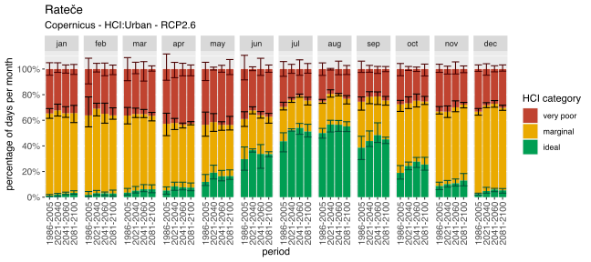<!-- --><!-- --><!-- --><!-- -->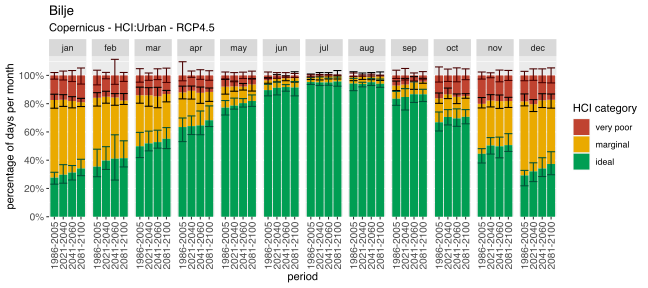<!-- --><!-- --><!-- --><!-- -->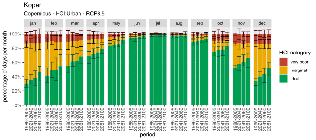<!-- --><!-- --><!-- --><!-- -->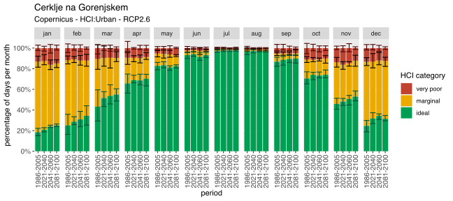<!-- -->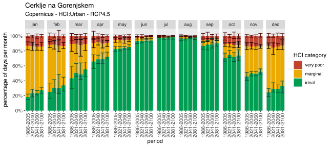<!-- -->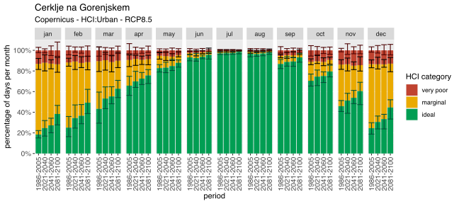<!-- --><!-- --><!-- -->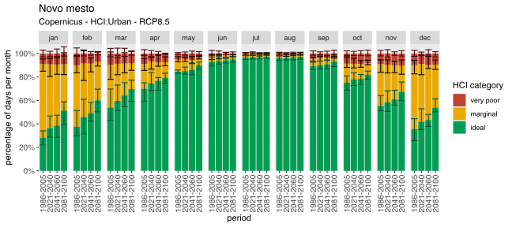<!-- --><!-- --><!-- -->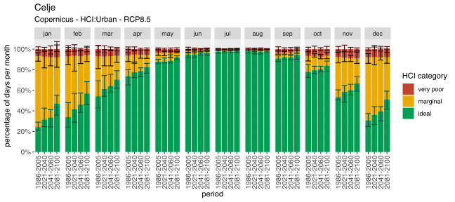<!-- --><!-- -->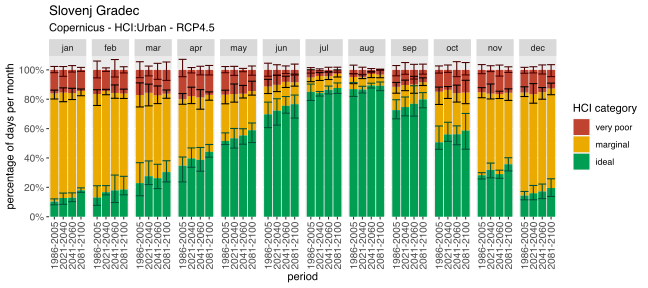<!-- -->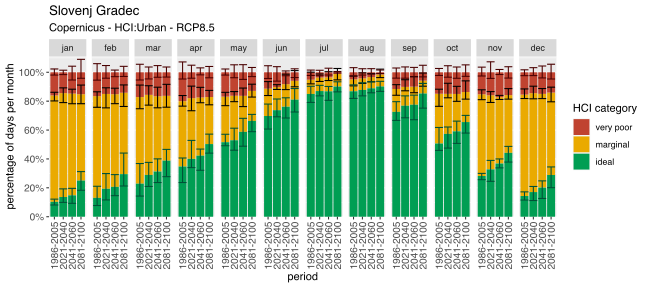<!-- -->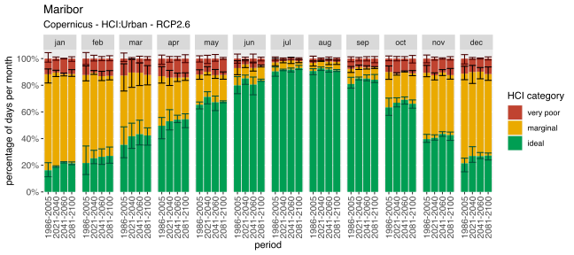<!-- --><!-- --><!-- -->

Save all the plots:

``` r
for (stat_id in gridpoint_indexes) {
    for (scen in scenarios) {
        stat_name <- names[match(stat_id, gridpoint_indexes)]
        print(paste("HCI", stat_name, scen))

        p <- plotdata(stat_id, scen, all_hci_data)
        
        ggsave(paste("HCI_", gsub(" ", "_", stat_name), "_", scen, ".pdf", sep=""), p, width=8, height=4, units="in", path="../output/pdf/HCI", device=cairo_pdf)
        ggsave(paste("HCI_", gsub(" ", "_", stat_name), "_", scen, ".eps", sep=""), p, width=8, height=4, units="in", path="../output/eps/HCI", device=cairo_ps)
        ggsave(paste("HCI_", gsub(" ", "_", stat_name), "_", scen, ".svg", sep=""), p, width=8, height=4, units="in", path="../output/svg/HCI")
        ggsave(paste("HCI_", gsub(" ", "_", stat_name), "_", scen, ".png", sep=""), p, width=8, height=4, units="in", path="../output/png/HCI", dpi=500)
    }
}
```
