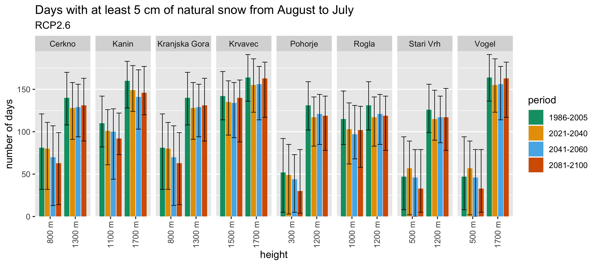
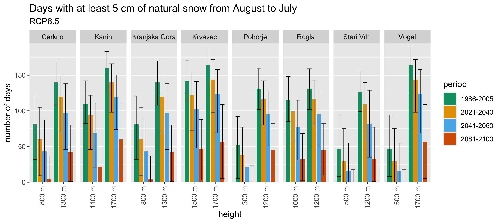
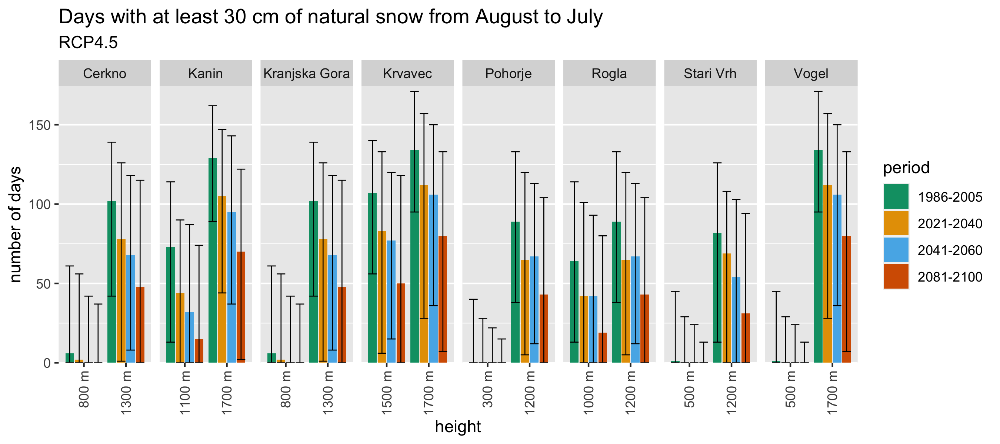
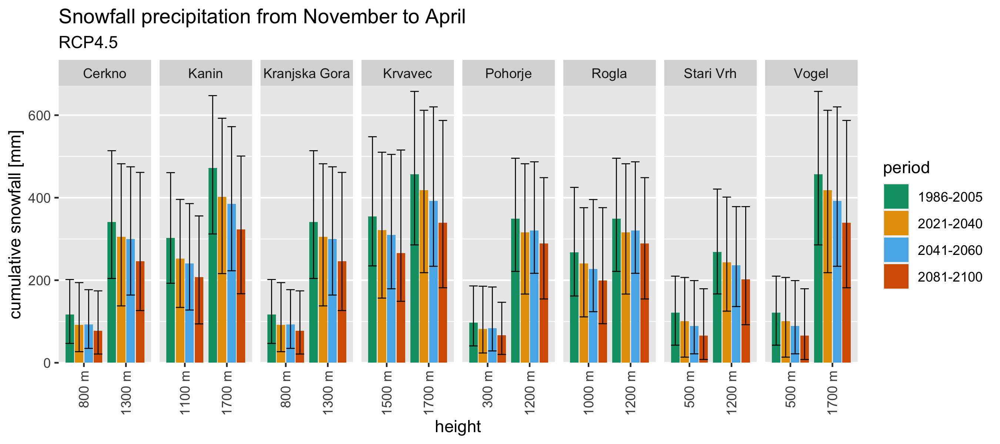
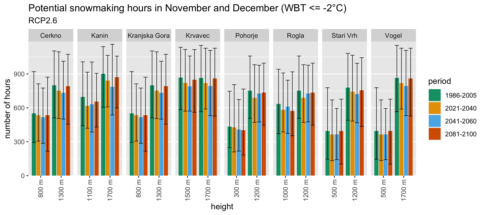
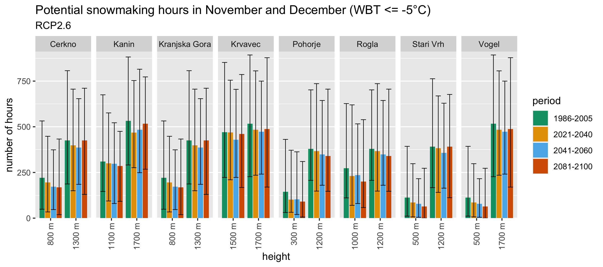

Snow
================

``` r
library(ncdf4)
library(dplyr)
```

    ## 
    ## Attaching package: 'dplyr'

    ## The following objects are masked from 'package:stats':
    ## 
    ##     filter, lag

    ## The following objects are masked from 'package:base':
    ## 
    ##     intersect, setdiff, setequal, union

``` r
library(readr)
library(forcats)
library(ggplot2)
library(sf)
```

    ## Linking to GEOS 3.9.1, GDAL 3.4.0, PROJ 8.1.1; sf_use_s2() is TRUE

``` r
library(rnaturalearth)
library(plotly) # remove
```

    ## 
    ## Attaching package: 'plotly'

    ## The following object is masked from 'package:ggplot2':
    ## 
    ##     last_plot

    ## The following object is masked from 'package:stats':
    ## 
    ##     filter

    ## The following object is masked from 'package:graphics':
    ## 
    ##     layout

``` r
library(ggrepel)
```

Read data from NUTS-3 geopackage (borders between regions). Downloaded
from auxillary files at
[CDS](https://cds.climate.copernicus.eu/cdsapp#!/dataset/sis-tourism-snow-indicators?tab=doc).

``` r
nuts3_mapdata <- st_read("geodata/NUTS3_ID.gpkg")
```

    ## Reading layer `NUTS3_ID' from data source 
    ##   `/Users/rokuk/Documents/Work/BFUL/Turizem-projekcije/R/geodata/NUTS3_ID.gpkg' 
    ##   using driver `GPKG'
    ## Simple feature collection with 1524 features and 8 fields
    ## Geometry type: MULTIPOLYGON
    ## Dimension:     XY
    ## Bounding box:  xmin: -7030022 ymin: -2438080 xmax: 6215534 ymax: 11462690
    ## Projected CRS: WGS 84 / Pseudo-Mercator

Select Slovenian NUTS-3 regions and get ther ids:

``` r
slovenia_nuts3_mapdata <- filter(nuts3_mapdata, cntr_code=="SI")
slovenia_nuts3_ids <- pull(slovenia_nuts3_mapdata, fid)
slovenia_nuts3_names <- pull(slovenia_nuts3_mapdata, nuts_name)
print(slovenia_nuts3_ids)
```

    ##  [1] "SI038" "SI034" "SI035" "SI033" "SI036" "SI037" "SI041" "SI042" "SI043"
    ## [10] "SI044" "SI032" "SI031"

We define a function to read data from netcdf files. The function
returns a data frame with longitudes, latitudes, heights, NUTS-3 region
id and value of `datavarname` variable at each point.

``` r
readcdf <- function(filepath, datavarname) {
    nc_data <- nc_open(filepath)

    lon <- ncvar_get(nc_data, "LON")
    lat <- ncvar_get(nc_data, "LAT")
    datapoint <- ncvar_get(nc_data, datavarname)
    height <- ncvar_get(nc_data, "ZS")
    nuts3id <- ncvar_get(nc_data, "NUTS3_ID")
    
    nc_close(nc_data)
    
    df <- data.frame(
        lon = lon, 
        lat = lat, 
        height = height, 
        nuts3id = nuts3id, 
        datapoint=datapoint
    )
    
    return (df)
}
```

Read data from one netcdf file and select datapoints in Slovenian
regions:

``` r
dataset <- readcdf("../data/snow/historical/sd-days-5-NS_HISTORICAL_Mean_1986-2005_v1.nc", "sd_days") %>% 
    filter(nuts3id %in% slovenia_nuts3_ids)
regions <- distinct(dataset, nuts3id, .keep_all=T) %>% 
    select(lon, lat, nuts3id) %>% 
    mutate(name=gsub("Å¡","š", slovenia_nuts3_names[match(nuts3id, slovenia_nuts3_ids)]))
print(regions)
```

    ##         lon      lat nuts3id                  name
    ## 1  14.30632 45.68736   SI038  Primorsko-notranjska
    ## 2  15.02106 45.70808   SI037 Jugovzhodna Slovenija
    ## 3  13.88285 45.62179   SI044         Obalno-kraška
    ## 4  13.77725 46.09002   SI043               Goriška
    ## 5  15.43760 45.96600   SI036              Posavska
    ## 6  14.56583 46.02554   SI041     Osrednjeslovenska
    ## 7  14.13987 46.30333   SI042             Gorenjska
    ## 8  14.97124 46.09972   SI035              Zasavska
    ## 9  15.19567 46.27018   SI034             Savinjska
    ## 10 15.75228 46.47155   SI032             Podravska
    ## 11 15.08801 46.53133   SI033               Koroška
    ## 12 16.18284 46.66385   SI031              Pomurska

Read ski resort data (heights rounded to 100 m):

``` r
skidata <- read_csv("../data/skiresorts.csv", show_col_types = F) %>%
    mutate(region_name=gsub("Å¡","š", slovenia_nuts3_names[match(nuts3id, slovenia_nuts3_ids)]))
print.data.frame(skidata)
```

    ##      ski_resort      lat      lon lowest highest nuts3id region_name
    ## 1        Cerkno 46.16251 14.05852    800    1300   SI042   Gorenjska
    ## 2         Kanin 46.35882 13.47624   1100    2300   SI043     Goriška
    ## 3 Kranjska Gora 46.48576 13.77673    800    1300   SI042   Gorenjska
    ## 4       Krvavec 46.30159 14.52695   1500    2000   SI042   Gorenjska
    ## 5       Pohorje 46.53328 15.60030    300    1300   SI032   Podravska
    ## 6         Rogla 46.45059 15.34987   1000    1500   SI032   Podravska
    ## 7     Stari Vrh 46.18306 14.19184    500    1200   SI042   Gorenjska
    ## 8         Vogel 46.26346 13.84031    500    1800   SI042   Gorenjska

Plot Slovenian NUTS3 regions (black) and ski resort locations (red):

``` r
ggplot() +
    geom_sf(data=slovenia_nuts3_mapdata) +
    geom_point(data=skidata, mapping=aes(lon, lat), color="red") +
    geom_label_repel(data=skidata, mapping=aes(lon, lat, label=ski_resort), min.segment.length = 0.2, box.padding = 0.2, color="brown", nudge_y = 46.68-skidata$lat, force=20) +
    geom_point(data=regions, mapping=aes(lon, lat)) +
    geom_label(data=regions, mapping=aes(lon, lat, label=name), nudge_y = -0.055, size = 2.5) +
    coord_sf(crs = st_crs(4326)) +
    xlab("longitude") +
    ylab("latitude") +
    theme_light()
```

<!-- -->

## Assemble data

Define variable values:

``` r
time_periods <- c("2021-2040", "2041-2060", "2081-2100")
scenarios <- c("RCP26", "RCP45", "RCP85")
metrics <- c("Q10", "Q50", "Q90")
variables <- c("sd-days-5-NS", "sd-days-30-NS", "snowfall-amount-winter", "wbt-2-hrs", "wbt-5-hrs")
# variable name used in netcdf file for each of the above variables:
datavarnames <- c("sd_days", "sd_days", "snowfall_amount", "wbt_hrs", "wbt_hrs")
# name of variables for plotting:
plotvarnames <- c("Days with at least 5 cm of natural snow from August to July", "Days with at least 30 cm of natural snow from August to July", "Snowfall precipitation from November to April", "Potential snowmaking hours in November and December (WBT < -2\u00B0C)", "Potential snowmaking hours in November and December (WBT < -5\u00B0C)")
# labels for y axis for each variable:
yaxislabels <- c("number of days", "number of days", "cumulative snowfall [mm]", "number of hours", "number of hours")
```

``` r
alldata <- data.frame(matrix(ncol = 7, nrow = 0)) # create empty dataframe

# read and extract historical data
for (variable in variables) {
    for (metric in metrics) {
        print(paste(variable, "historical", "1986-2005", metric))
            
            # construct path of netcdf file
        filepath <- paste("../data/snow/historical/", variable, "_HISTORICAL_", metric, "_1986-2005_v1.nc", sep = "")
        datavarname <- datavarnames[match(variable, variables)]
        
        dataset <- readcdf(filepath, datavarname) %>%
            filter(nuts3id %in% slovenia_nuts3_ids)
        
        alldata <- rbind(alldata, data.frame(
            variable=variable,
            scenario="historical", 
            time_period="1986-2005", 
            metric=metric,
            nuts3id=dataset$nuts3id,
            height=dataset$height,
            datapoint=dataset$datapoint))
    }
}
```

    ## [1] "sd-days-5-NS historical 1986-2005 Q10"
    ## [1] "sd-days-5-NS historical 1986-2005 Q50"
    ## [1] "sd-days-5-NS historical 1986-2005 Q90"
    ## [1] "sd-days-30-NS historical 1986-2005 Q10"
    ## [1] "sd-days-30-NS historical 1986-2005 Q50"
    ## [1] "sd-days-30-NS historical 1986-2005 Q90"
    ## [1] "snowfall-amount-winter historical 1986-2005 Q10"
    ## [1] "snowfall-amount-winter historical 1986-2005 Q50"
    ## [1] "snowfall-amount-winter historical 1986-2005 Q90"
    ## [1] "wbt-2-hrs historical 1986-2005 Q10"
    ## [1] "wbt-2-hrs historical 1986-2005 Q50"
    ## [1] "wbt-2-hrs historical 1986-2005 Q90"
    ## [1] "wbt-5-hrs historical 1986-2005 Q10"
    ## [1] "wbt-5-hrs historical 1986-2005 Q50"
    ## [1] "wbt-5-hrs historical 1986-2005 Q90"

``` r
# read and extract RCP2.6, RCP4.5 and RCP8.5 data
for (variable in variables) {
    for (scenario in scenarios) {
        for (time_period in time_periods) {
            for (metric in metrics) {
                print(paste(variable, scenario, time_period, metric))
            
                # construct path of netcdf file
                filepath <- paste("../data/snow/", scenario, "/", variable, "_", scenario, "_", metric, "_", time_period, "_v1.nc", sep = "")
                datavarname <- datavarnames[match(variable, variables)]
                
                # read data and select only datapoints for our regions
                dataset <- readcdf(filepath, datavarname) %>%
                    filter(nuts3id %in% slovenia_nuts3_ids)
                
                alldata <- rbind(alldata, data.frame(
                    variable=variable,
                    scenario=scenario, 
                    time_period=time_period, 
                    metric=metric,
                    nuts3id=dataset$nuts3id,
                    height=dataset$height,
                    datapoint=dataset$datapoint))
            }
        }
    }
}
```

    ## [1] "sd-days-5-NS RCP26 2021-2040 Q10"
    ## [1] "sd-days-5-NS RCP26 2021-2040 Q50"
    ## [1] "sd-days-5-NS RCP26 2021-2040 Q90"
    ## [1] "sd-days-5-NS RCP26 2041-2060 Q10"
    ## [1] "sd-days-5-NS RCP26 2041-2060 Q50"
    ## [1] "sd-days-5-NS RCP26 2041-2060 Q90"
    ## [1] "sd-days-5-NS RCP26 2081-2100 Q10"
    ## [1] "sd-days-5-NS RCP26 2081-2100 Q50"
    ## [1] "sd-days-5-NS RCP26 2081-2100 Q90"
    ## [1] "sd-days-5-NS RCP45 2021-2040 Q10"
    ## [1] "sd-days-5-NS RCP45 2021-2040 Q50"
    ## [1] "sd-days-5-NS RCP45 2021-2040 Q90"
    ## [1] "sd-days-5-NS RCP45 2041-2060 Q10"
    ## [1] "sd-days-5-NS RCP45 2041-2060 Q50"
    ## [1] "sd-days-5-NS RCP45 2041-2060 Q90"
    ## [1] "sd-days-5-NS RCP45 2081-2100 Q10"
    ## [1] "sd-days-5-NS RCP45 2081-2100 Q50"
    ## [1] "sd-days-5-NS RCP45 2081-2100 Q90"
    ## [1] "sd-days-5-NS RCP85 2021-2040 Q10"
    ## [1] "sd-days-5-NS RCP85 2021-2040 Q50"
    ## [1] "sd-days-5-NS RCP85 2021-2040 Q90"
    ## [1] "sd-days-5-NS RCP85 2041-2060 Q10"
    ## [1] "sd-days-5-NS RCP85 2041-2060 Q50"
    ## [1] "sd-days-5-NS RCP85 2041-2060 Q90"
    ## [1] "sd-days-5-NS RCP85 2081-2100 Q10"
    ## [1] "sd-days-5-NS RCP85 2081-2100 Q50"
    ## [1] "sd-days-5-NS RCP85 2081-2100 Q90"
    ## [1] "sd-days-30-NS RCP26 2021-2040 Q10"
    ## [1] "sd-days-30-NS RCP26 2021-2040 Q50"
    ## [1] "sd-days-30-NS RCP26 2021-2040 Q90"
    ## [1] "sd-days-30-NS RCP26 2041-2060 Q10"
    ## [1] "sd-days-30-NS RCP26 2041-2060 Q50"
    ## [1] "sd-days-30-NS RCP26 2041-2060 Q90"
    ## [1] "sd-days-30-NS RCP26 2081-2100 Q10"
    ## [1] "sd-days-30-NS RCP26 2081-2100 Q50"
    ## [1] "sd-days-30-NS RCP26 2081-2100 Q90"
    ## [1] "sd-days-30-NS RCP45 2021-2040 Q10"
    ## [1] "sd-days-30-NS RCP45 2021-2040 Q50"
    ## [1] "sd-days-30-NS RCP45 2021-2040 Q90"
    ## [1] "sd-days-30-NS RCP45 2041-2060 Q10"
    ## [1] "sd-days-30-NS RCP45 2041-2060 Q50"
    ## [1] "sd-days-30-NS RCP45 2041-2060 Q90"
    ## [1] "sd-days-30-NS RCP45 2081-2100 Q10"
    ## [1] "sd-days-30-NS RCP45 2081-2100 Q50"
    ## [1] "sd-days-30-NS RCP45 2081-2100 Q90"
    ## [1] "sd-days-30-NS RCP85 2021-2040 Q10"
    ## [1] "sd-days-30-NS RCP85 2021-2040 Q50"
    ## [1] "sd-days-30-NS RCP85 2021-2040 Q90"
    ## [1] "sd-days-30-NS RCP85 2041-2060 Q10"
    ## [1] "sd-days-30-NS RCP85 2041-2060 Q50"
    ## [1] "sd-days-30-NS RCP85 2041-2060 Q90"
    ## [1] "sd-days-30-NS RCP85 2081-2100 Q10"
    ## [1] "sd-days-30-NS RCP85 2081-2100 Q50"
    ## [1] "sd-days-30-NS RCP85 2081-2100 Q90"
    ## [1] "snowfall-amount-winter RCP26 2021-2040 Q10"
    ## [1] "snowfall-amount-winter RCP26 2021-2040 Q50"
    ## [1] "snowfall-amount-winter RCP26 2021-2040 Q90"
    ## [1] "snowfall-amount-winter RCP26 2041-2060 Q10"
    ## [1] "snowfall-amount-winter RCP26 2041-2060 Q50"
    ## [1] "snowfall-amount-winter RCP26 2041-2060 Q90"
    ## [1] "snowfall-amount-winter RCP26 2081-2100 Q10"
    ## [1] "snowfall-amount-winter RCP26 2081-2100 Q50"
    ## [1] "snowfall-amount-winter RCP26 2081-2100 Q90"
    ## [1] "snowfall-amount-winter RCP45 2021-2040 Q10"
    ## [1] "snowfall-amount-winter RCP45 2021-2040 Q50"
    ## [1] "snowfall-amount-winter RCP45 2021-2040 Q90"
    ## [1] "snowfall-amount-winter RCP45 2041-2060 Q10"
    ## [1] "snowfall-amount-winter RCP45 2041-2060 Q50"
    ## [1] "snowfall-amount-winter RCP45 2041-2060 Q90"
    ## [1] "snowfall-amount-winter RCP45 2081-2100 Q10"
    ## [1] "snowfall-amount-winter RCP45 2081-2100 Q50"
    ## [1] "snowfall-amount-winter RCP45 2081-2100 Q90"
    ## [1] "snowfall-amount-winter RCP85 2021-2040 Q10"
    ## [1] "snowfall-amount-winter RCP85 2021-2040 Q50"
    ## [1] "snowfall-amount-winter RCP85 2021-2040 Q90"
    ## [1] "snowfall-amount-winter RCP85 2041-2060 Q10"
    ## [1] "snowfall-amount-winter RCP85 2041-2060 Q50"
    ## [1] "snowfall-amount-winter RCP85 2041-2060 Q90"
    ## [1] "snowfall-amount-winter RCP85 2081-2100 Q10"
    ## [1] "snowfall-amount-winter RCP85 2081-2100 Q50"
    ## [1] "snowfall-amount-winter RCP85 2081-2100 Q90"
    ## [1] "wbt-2-hrs RCP26 2021-2040 Q10"
    ## [1] "wbt-2-hrs RCP26 2021-2040 Q50"
    ## [1] "wbt-2-hrs RCP26 2021-2040 Q90"
    ## [1] "wbt-2-hrs RCP26 2041-2060 Q10"
    ## [1] "wbt-2-hrs RCP26 2041-2060 Q50"
    ## [1] "wbt-2-hrs RCP26 2041-2060 Q90"
    ## [1] "wbt-2-hrs RCP26 2081-2100 Q10"
    ## [1] "wbt-2-hrs RCP26 2081-2100 Q50"
    ## [1] "wbt-2-hrs RCP26 2081-2100 Q90"
    ## [1] "wbt-2-hrs RCP45 2021-2040 Q10"
    ## [1] "wbt-2-hrs RCP45 2021-2040 Q50"
    ## [1] "wbt-2-hrs RCP45 2021-2040 Q90"
    ## [1] "wbt-2-hrs RCP45 2041-2060 Q10"
    ## [1] "wbt-2-hrs RCP45 2041-2060 Q50"
    ## [1] "wbt-2-hrs RCP45 2041-2060 Q90"
    ## [1] "wbt-2-hrs RCP45 2081-2100 Q10"
    ## [1] "wbt-2-hrs RCP45 2081-2100 Q50"
    ## [1] "wbt-2-hrs RCP45 2081-2100 Q90"
    ## [1] "wbt-2-hrs RCP85 2021-2040 Q10"
    ## [1] "wbt-2-hrs RCP85 2021-2040 Q50"
    ## [1] "wbt-2-hrs RCP85 2021-2040 Q90"
    ## [1] "wbt-2-hrs RCP85 2041-2060 Q10"
    ## [1] "wbt-2-hrs RCP85 2041-2060 Q50"
    ## [1] "wbt-2-hrs RCP85 2041-2060 Q90"
    ## [1] "wbt-2-hrs RCP85 2081-2100 Q10"
    ## [1] "wbt-2-hrs RCP85 2081-2100 Q50"
    ## [1] "wbt-2-hrs RCP85 2081-2100 Q90"
    ## [1] "wbt-5-hrs RCP26 2021-2040 Q10"
    ## [1] "wbt-5-hrs RCP26 2021-2040 Q50"
    ## [1] "wbt-5-hrs RCP26 2021-2040 Q90"
    ## [1] "wbt-5-hrs RCP26 2041-2060 Q10"
    ## [1] "wbt-5-hrs RCP26 2041-2060 Q50"
    ## [1] "wbt-5-hrs RCP26 2041-2060 Q90"
    ## [1] "wbt-5-hrs RCP26 2081-2100 Q10"
    ## [1] "wbt-5-hrs RCP26 2081-2100 Q50"
    ## [1] "wbt-5-hrs RCP26 2081-2100 Q90"
    ## [1] "wbt-5-hrs RCP45 2021-2040 Q10"
    ## [1] "wbt-5-hrs RCP45 2021-2040 Q50"
    ## [1] "wbt-5-hrs RCP45 2021-2040 Q90"
    ## [1] "wbt-5-hrs RCP45 2041-2060 Q10"
    ## [1] "wbt-5-hrs RCP45 2041-2060 Q50"
    ## [1] "wbt-5-hrs RCP45 2041-2060 Q90"
    ## [1] "wbt-5-hrs RCP45 2081-2100 Q10"
    ## [1] "wbt-5-hrs RCP45 2081-2100 Q50"
    ## [1] "wbt-5-hrs RCP45 2081-2100 Q90"
    ## [1] "wbt-5-hrs RCP85 2021-2040 Q10"
    ## [1] "wbt-5-hrs RCP85 2021-2040 Q50"
    ## [1] "wbt-5-hrs RCP85 2021-2040 Q90"
    ## [1] "wbt-5-hrs RCP85 2041-2060 Q10"
    ## [1] "wbt-5-hrs RCP85 2041-2060 Q50"
    ## [1] "wbt-5-hrs RCP85 2041-2060 Q90"
    ## [1] "wbt-5-hrs RCP85 2081-2100 Q10"
    ## [1] "wbt-5-hrs RCP85 2081-2100 Q50"
    ## [1] "wbt-5-hrs RCP85 2081-2100 Q90"

Extract data at heights corresponding to ski resorts and compute
errorbar locations:

``` r
data_at_skiresorts <- data.frame(matrix(ncol=7, nrow=0))
heights <- distinct(alldata, height) %>% pull(height)
heightlevels <- heights[order(heights)]

for (i in 1:nrow(skidata)) {
    selection <- filter(alldata, nuts3id==pull(skidata, "nuts3id")[i] & height >= pull(skidata, "lowest")[i] & height <= pull(skidata, "highest")[i])
    
    data_at_skiresorts <- rbind(data_at_skiresorts, data.frame(
        name=skidata$ski_resort[i],
        variable=selection[selection$metric=="Q50", "variable"],
        scenario=factor(selection[selection$metric=="Q50", "scenario"], levels=c("historical", "RCP26", "RCP45", "RCP85")),
        time_period=selection[selection$metric=="Q50", "time_period"],
        height=factor(selection[selection$metric=="Q50", "height"], levels=heightlevels),
        prct50=selection[selection$metric=="Q50", "datapoint"],
        lower=selection[selection$metric=="Q10", "datapoint"],
        upper=selection[selection$metric=="Q90", "datapoint"]
    ))
}
```

``` r
data_at_regions <- data.frame(matrix(ncol=7, nrow=0))
ski_regions <- unique(skidata$nuts3id)

for (i in 1:length(ski_regions)) {
    selection <- filter(alldata, nuts3id==ski_regions[i])
    
    data_at_regions <- rbind(data_at_regions, data.frame(
        regionid=ski_regions[i],
        variable=selection[selection$metric=="Q50", "variable"],
        scenario=factor(selection[selection$metric=="Q50", "scenario"], levels=c("historical", "RCP26", "RCP45", "RCP85")),
        time_period=selection[selection$metric=="Q50", "time_period"],
        height=factor(selection[selection$metric=="Q50", "height"], levels=heightlevels),
        prct50=selection[selection$metric=="Q50", "datapoint"],
        lower=selection[selection$metric=="Q10", "datapoint"],
        upper=selection[selection$metric=="Q90", "datapoint"]
    ))
}
```

## Plots

``` r
plotdata1 <- function(resortname, var, data_at_skiresorts) {
    lowest <- filter(skidata, ski_resort==resortname)$lowest
    highest <- filter(skidata, ski_resort==resortname)$highest
    if (highest > 1700) { # if highest point is higher than 1700 (max height in dataset), just use 1700 m
        highest <- 1700
    }
    if (resortname == "Rogla" | resortname == "Pohorje") {
        highest <- 1200
    }

    temp <- data_at_skiresorts %>% filter(name==resortname & variable==var & (height==lowest | height==highest))
    temp$height <- fct_relabel(temp$height, ~ paste(.x, "m"))

    p <- ggplot(temp, aes(x = time_period, y = prct50, fill = scenario)) +
        geom_col(position = position_dodge2(width = 1, preserve = "single")) +
        #geom_col(position = "dodge") +
        facet_grid(~height) +
        scale_fill_manual(values = c("#009E73", "#E69F00", "#56B4E9", "#D55E00")) +
        labs(title = resortname, subtitle = var) +
        geom_errorbar(mapping = aes(ymax=upper, ymin=lower), stat="identity", width=0.9, position = position_dodge2(preserve = "single"))
    
    return (p)
}

plotdata2 <- function(resortname, data_at_skiresorts) {
    lowest <- filter(skidata, ski_resort==resortname)$lowest
    highest <- filter(skidata, ski_resort==resortname)$highest
    if (highest > 1700) { # if highest point is higher than 1700 (max height in dataset), just use 1700 m
        highest <- 1700
    }
    if (resortname == "Rogla" | resortname == "Pohorje") {
        highest <- 1200
    }

    temp <- data_at_skiresorts %>% filter(name==resortname & (height==lowest | height==highest))
    temp$height <- fct_relabel(temp$height, ~ paste(.x, "m"))

    p <- ggplot(temp, aes(x = time_period, y = prct50, fill = scenario)) +
        geom_col(position = position_dodge2(width = 1, preserve = "single")) +
        #geom_col(position = "dodge") +
        facet_grid(variable~height, scales="free") +
        scale_fill_manual(values = c("#009E73", "#E69F00", "#56B4E9", "#D55E00")) +
        labs(title = resortname) +
        geom_errorbar(mapping = aes(ymax=upper, ymin=lower), stat="identity", width=0.9, position = position_dodge2(preserve = "single"))
    
    return (p)
}

plotdata3 <- function(scen, var, data_at_skiresorts) {
    data_plot <- data.frame(matrix(nrow=0, ncol=8))
    
    for (resortname in skidata %>% pull(ski_resort)) {
        lowest <- filter(skidata, ski_resort==resortname)$lowest
        highest <- filter(skidata, ski_resort==resortname)$highest
        
        if (highest > 1700) { # if highest point is higher than 1700 (max height in dataset), just use 1700 m
            highest <- 1700
        }
        if (resortname == "Rogla" | resortname == "Pohorje") {
            highest <- 1200
        }
        
        temp_part <- data_at_skiresorts %>% filter(name==resortname & variable==var & (scenario==scen | scenario=="historical") & (height==lowest | height==highest))
        data_plot <- rbind(data_plot, temp_part)
    }
    
    if (scen == "RCP26") {
        scen <- "RCP2.6"
    } else if (scen == "RCP45") {
        scen <- "RCP4.5"
    } else if (scen == "RCP85") {
        scen <- "RCP8.5"
    }
    
    data_plot$height <- fct_relabel(data_plot$height, ~ paste(.x, "m"))

    p <- ggplot(data_plot, aes(x = height, y = prct50, fill = time_period)) +
        geom_col(position = position_dodge2(width = 1, preserve = "single")) +
        #geom_col(position = "dodge") +
        facet_grid(~name, scales="free") +
        scale_fill_manual(values = c("#009E73", "#E69F00", "#56B4E9", "#D55E00")) +
        labs(title = plotvarnames[match(var, variables)], subtitle = scen, fill="Period") +
        xlab("height") + 
        ylab(yaxislabels[match(var, variables)]) +
        guides(x = guide_axis(angle = 90)) +
        geom_errorbar(mapping = aes(ymax=upper, ymin=lower), stat="identity", size=0.3, width=0.9, position = position_dodge2(preserve = "single"))
        #scale_colour_manual(values = c("#005E43", "#866F00", "#266489", "#852E00"), guide="none") # errorbar color
        
    return (p)
}

#plotdata1("Cerkno", "snowfall-amount-winter", data_at_skiresorts)
#plotdata2("Cerkno", data_at_skiresorts)
#plotdata3("RCP85", "snowfall-amount-winter", data_at_skiresorts)
```

``` r
for (j in 1:nrow(skidata)) {
    for (var in variables) {
        p <- plotdata1(pull(skidata, ski_resort)[j], var, data_at_skiresorts)
        print(p)
    }
}
```

``` r
for (j in 1:nrow(skidata)) {
    p <- plotdata2(pull(skidata, ski_resort)[j], data_at_skiresorts)
    print(p)
}
```

``` r
for (var in variables) {
    for (scen in scenarios) {
        p <- plotdata3(scen, var, data_at_skiresorts)
        print(p)
    }
}
```

<!-- --><!-- --><!-- --><!-- --><!-- --><!-- --><!-- --><!-- --><!-- --><!-- --><!-- --><!-- --><!-- --><!-- --><!-- -->
