Weather stations
================

This code reads data from Excel files (received from ARSO) and makes
plots for selected stations.

## Importing libraries and data

``` r
library(readxl)
library(dplyr)
```

    ## 
    ## Attaching package: 'dplyr'

    ## The following objects are masked from 'package:stats':
    ## 
    ##     filter, lag

    ## The following objects are masked from 'package:base':
    ## 
    ##     intersect, setdiff, setequal, union

``` r
library(forcats)
library(ggplot2)
```

Define variable values:

``` r
filenames <- c("rr1", "rr2", "snow", "warm", "hot", "tropical") # excel file names
variablenames <- c("Days with at least 1 mm of precipitation", "Days with at least 20 mm of precipitation", "Days with snow", expression("Warm days (T"["max"]*" \u2265 25\u00B0C)"), expression("Hot days (T"["max"]*" \u2265 30\u00B0C)"), expression("Tropical nights (T"["min"]*" \u2265 20\u00B0C)")) # display variable names
axislabels <- c("percentage of days per month", "percentage of days per month", "percentage of days per month", "percentage of days per month", "percentage of days per month", "percentage of nights per month")
projnames <- c("RCP45", "RCP85", "RCP26") # excel sheet names
scenarionames <- c("RCP4.5", "RCP8.5", "RCP2.6") # display scenario names
monthnames <- c("jan", "feb", "mar", "apr", "may", "jun", "jul", "aug", "sep", "oct", "nov", "dec")
stationnames_raw <- c("BILJE", "CELJE - MEDLOG", "LETALIŠČE EDVARDA RUSJANA MARIBOR", "LJUBLJANA - BEŽIGRAD", "MURSKA SOBOTA - RAKIČAN", "NOVO MESTO", "PORTOROŽ - LETALIŠČE", "RATEČE", "CERKLJE - LETALIŠČE", "ŠMARTNO PRI SLOVENJ GRADCU")
stationnames_1 <- c("Bilje", "Celje - Medlog", "Letališče Edvarda Rusjana Maribor", "Ljubljana - Bežigrad", "Murska Sobota - Rakičan", "Novo mesto", "Portorož - letališče", "Rateče", "Cerklje - letališče", "Šmartno pri Slovenj Gradcu")
stationnames_2 <- c("Bilje", "Celje Medlog", "Letališče Edvarda Rusjana Maribor", "Ljubljana Bežigrad", "Murska Sobota Rakičan", "Novo mesto", "Portorož letališče", "Rateče", "Cerklje letališče", "Šmartno pri Slovenj Gradcu")
```

Read data from Excel files:

``` r
refdata <- data.frame(matrix(nrow=0, ncol=6))
projdata <- data.frame(matrix(nrow=0, ncol=8))

for (file in filenames) {
    # read reference data
    ref <- read_excel(paste("../data/arso/", file, ".xlsx", sep=""), sheet=1)
    colnames <- names(ref)
    ref$month <- fct_relabel(factor(ref$month), function(x) monthnames[as.numeric(x)])
    
    for (statid in 2:length(colnames)) {
        refdata <- rbind(refdata, data.frame(
            var = file,
            period = "1981-2010",
            scenario = "ref",
            month = ref$month,
            station = colnames[statid],
            refvalue = pull(ref, colnames[statid])
        ))
    }
    
    # read RCP4.5, RCP8.5 and RCP2.6 data
    for (projid in 1:3) {
        proj <- read_excel(paste("../data/arso/", file, ".xlsx", sep=""), sheet = projid+1)
        proj$month <- fct_relabel(factor(proj$month), function(x) monthnames[as.numeric(x)])
        projdata <- rbind(projdata, data.frame(
            var = file,
            period = proj$period,
            scenario = scenarionames[projid],
            month = proj$month,
            station = proj$station,
            median = proj$median,
            min = proj$min,
            max = proj$max
        ))
    }
}

head(refdata)
```

    ##   var    period scenario month    station  refvalue
    ## 1 rr1 1981-2010      ref   jan NOVO MESTO  7.600000
    ## 2 rr1 1981-2010      ref   feb NOVO MESTO  6.794444
    ## 3 rr1 1981-2010      ref   mar NOVO MESTO  8.611111
    ## 4 rr1 1981-2010      ref   apr NOVO MESTO 10.405556
    ## 5 rr1 1981-2010      ref   may NOVO MESTO 11.911111
    ## 6 rr1 1981-2010      ref   jun NOVO MESTO 11.783333

``` r
head(projdata)
```

    ##   var    period scenario month                           station    median
    ## 1 rr1 2011-2040   RCP4.5   jan                        NOVO MESTO 0.3000000
    ## 2 rr1 2011-2040   RCP4.5   jan                    CELJE - MEDLOG 0.4166667
    ## 3 rr1 2011-2040   RCP4.5   jan           MURSKA SOBOTA - RAKIČAN 0.8333333
    ## 4 rr1 2011-2040   RCP4.5   jan                            RATEČE 0.5333333
    ## 5 rr1 2011-2040   RCP4.5   jan LETALIŠČE EDVARDA RUSJANA MARIBOR 0.6000000
    ## 6 rr1 2011-2040   RCP4.5   jan              LJUBLJANA - BEŽIGRAD 0.3166667
    ##          min      max
    ## 1 -0.8000000 2.400000
    ## 2 -1.0333333 2.633333
    ## 3 -1.1000000 2.600000
    ## 4 -1.3333333 1.933333
    ## 5 -0.9333333 2.266667
    ## 6 -0.7333333 2.166667

## Data wrangling

Projection data is given as a deviation from the reference value. Get
reference values for each projection datapoint and add them to median,
min and max values to obtain actual projection values:

``` r
refvals <- c()
for (i in 1:nrow(projdata)) {
    refvals <- rbind(refvals, refdata[refdata$month==projdata[i,4] & refdata$station==projdata[i,5] & refdata$var==projdata[i,1], "refvalue"])
}

projdata$median <- projdata$median + refvals
projdata$min <- projdata$min + refvals
projdata$max <- projdata$max + refvals
projdata[projdata$min < 0,"min"] <- 0 # set all negative values of minimum values to zero

head(projdata)
```

    ##   var    period scenario month                           station   median
    ## 1 rr1 2011-2040   RCP4.5   jan                        NOVO MESTO 7.900000
    ## 2 rr1 2011-2040   RCP4.5   jan                    CELJE - MEDLOG 7.983333
    ## 3 rr1 2011-2040   RCP4.5   jan           MURSKA SOBOTA - RAKIČAN 6.105556
    ## 4 rr1 2011-2040   RCP4.5   jan                            RATEČE 9.144444
    ## 5 rr1 2011-2040   RCP4.5   jan LETALIŠČE EDVARDA RUSJANA MARIBOR 6.827778
    ## 6 rr1 2011-2040   RCP4.5   jan              LJUBLJANA - BEŽIGRAD 8.277778
    ##        min       max
    ## 1 6.800000 10.000000
    ## 2 6.533333 10.200000
    ## 3 4.172222  7.872222
    ## 4 7.277778 10.544444
    ## 5 5.294444  8.494444
    ## 6 7.227778 10.127778

Combine reference and projection data frames for plotting:

``` r
alldata <- data.frame(matrix(nrow=0, ncol=8))
alldata <- rbind(alldata, projdata)

names(refdata)[names(refdata) == "refvalue"] <- "median"
refdata$min <- NA # reference data error bar range is set to 0
refdata$max <- NA

# add reference data to alldata frame for each scenario
refdata$scenario <- "RCP4.5"
alldata <- rbind(alldata, refdata)
refdata$scenario <- "RCP8.5"
alldata <- rbind(alldata, refdata)
refdata$scenario <- "RCP2.6"
alldata <- rbind(alldata, refdata)
```

Calculate percentages:

``` r
datadays31 <- filter(alldata, month == "jan" | month == "mar" | month == "may" | month == "jul" | month == "aug" | month == "oct" | month == "dec") %>% 
    mutate(median = median / 31, min = min / 31, max = max / 31)
datadays30 <- filter(alldata, month == "apr" | month == "jun" | month == "sep" | month == "nov") %>% mutate(median = median / 30, min = min / 30, max = max / 30)
datadays28_1 <- filter(alldata, month == "feb" & period == "2011-2040") %>%
    mutate(median = median / 28.2666666667, min = min / 28.2666666667, max = max / 28.2666666667)
datadays28_2 <- filter(alldata, month == "feb" & period != "2011-2040") %>%
    mutate(median = median / 28.2333333333, min = min / 28.2333333333, max = max / 28.2333333333)
alldata <- rbind(datadays31, datadays30, datadays28_1, datadays28_2)
```

## Plots

``` r
plotdata <- function(alldata, variable, stat) {
    subset <- filter(alldata, var==variable & station==stat)
    
    for (n in 1:length(stationnames_raw)) {
        subset[subset$station==stationnames_raw[n], "station"] <- stationnames_1[n]
    }
    
    p <- ggplot(data = subset, 
                mapping = aes(x = period, y = median, fill = period)) + 
        geom_col() +
        facet_grid(scenario~month) + 
        scale_fill_manual(values = c("#009E73", "#E69F00", "#56B4E9", "#D55E00")) +
        scale_y_continuous(expand = expansion(mult = c(0, 0.02)),
                           labels = scales::percent_format()) +
        ylab(axislabels[match(variable, filenames)]) + 
        labs(title = variablenames[match(variable, filenames)], subtitle = stationnames_1[match(stat, stationnames_raw)], fill="period") +
        geom_errorbar(mapping = aes(ymax=max, ymin=min), stat="identity", size=0.3, width=0.9) +
        theme(panel.grid.major.x = element_blank(),
              axis.title.x=element_blank(),
              axis.ticks.x=element_blank(),
              axis.text.x=element_blank(),
              panel.spacing.y = unit(0.8, "lines"))
    
    return (p)
}

plotdata2 <- function(alldata, variable, scen) {
    subset <- filter(alldata, var==variable & scenario==scen)
    
    for (m in 1:length(stationnames_raw)) {
        subset[subset$station==stationnames_raw[m], "station"] <- stationnames_2[m]
    }
    
    p <- ggplot(data = subset, 
                mapping = aes(x = period, y = median, fill = period)) + 
        geom_col() +
        facet_grid(station~month, labeller = label_wrap_gen(width=10)) + 
        scale_fill_manual(values = c("#009E73", "#E69F00", "#56B4E9", "#D55E00")) +
        scale_y_continuous(expand = expansion(mult = c(0, 0.02)),
                           labels = scales::percent_format(accuracy = 1)) +
        ylab(axislabels[match(variable, filenames)]) + 
        labs(title = variablenames[match(variable, filenames)], subtitle = scen, fill="period") +
        geom_errorbar(mapping = aes(ymax=max, ymin=min), stat="identity", size=0.3, width=0.9) +
        theme(panel.grid.major.x = element_blank(),
              axis.title.x=element_blank(),
              axis.ticks.x=element_blank(),
              axis.text.x=element_blank(),
              strip.text.y.right = element_text(angle = 0),
              panel.spacing.y = unit(0.7, "lines"))
    
    return (p)
}
```

``` r
for (var in filenames) {
    for (stat in distinct(alldata, station)$station) {
        p <- plotdata(alldata, var, stat)
        print(p)
    }
}
```

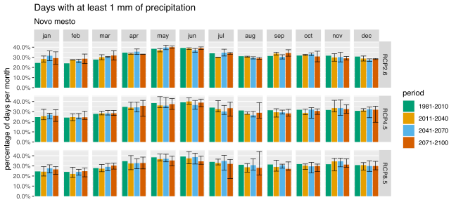<!-- -->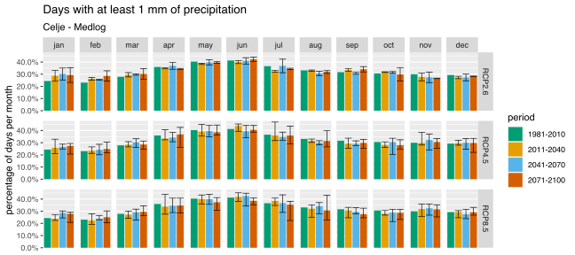<!-- -->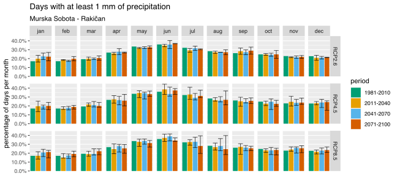<!-- --><!-- -->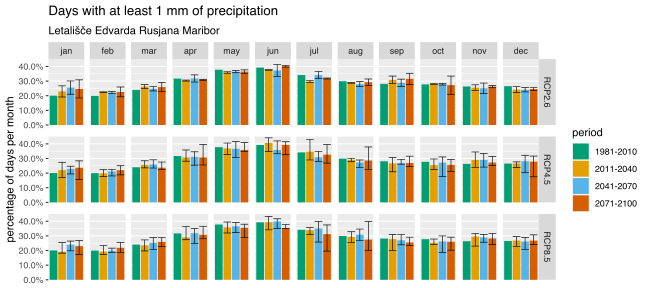<!-- -->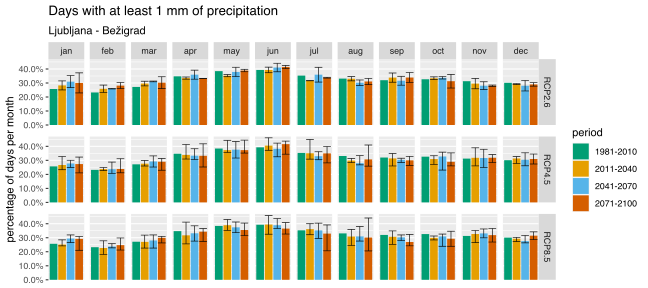<!-- -->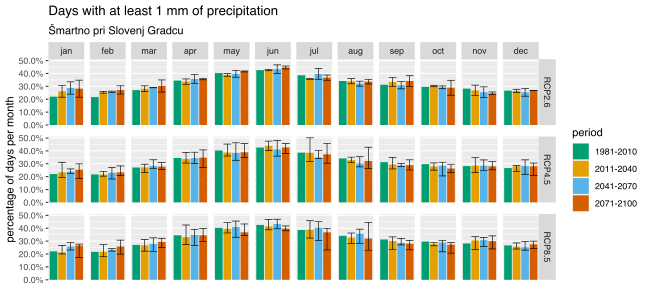<!-- --><!-- -->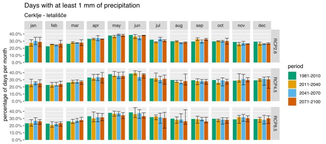<!-- -->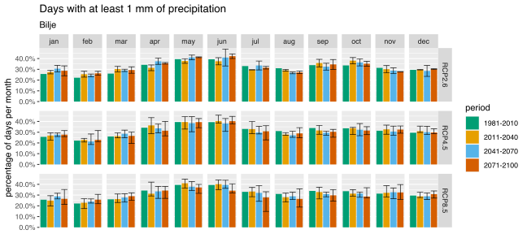<!-- -->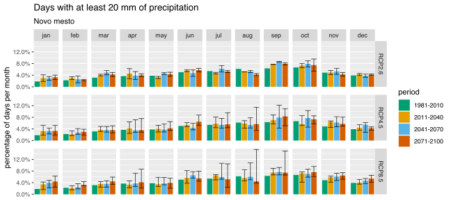<!-- --><!-- -->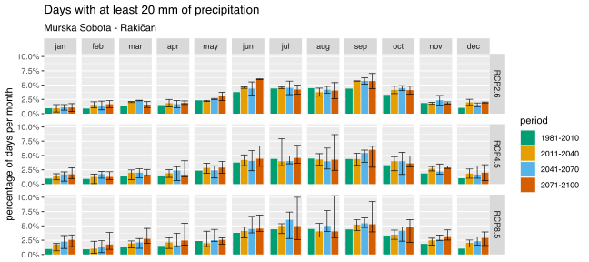<!-- -->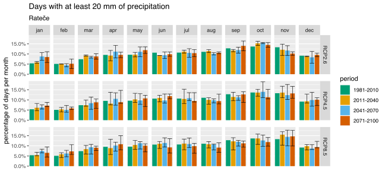<!-- -->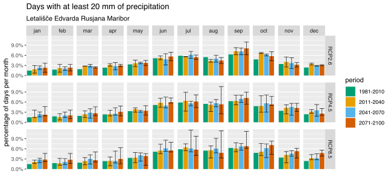<!-- -->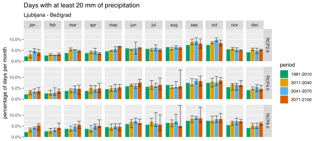<!-- -->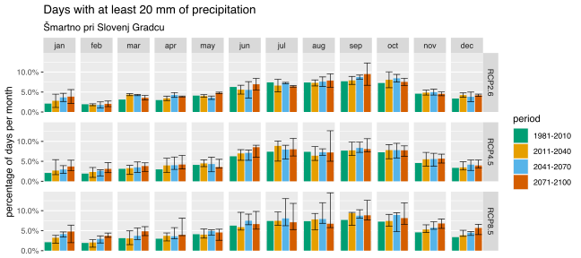<!-- -->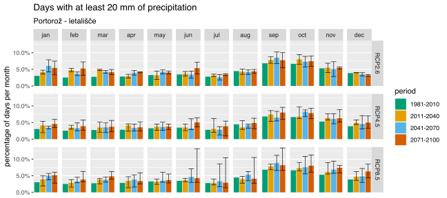<!-- --><!-- --><!-- --><!-- --><!-- --><!-- --><!-- --><!-- --><!-- --><!-- --><!-- --><!-- --><!-- --><!-- --><!-- --><!-- --><!-- --><!-- --><!-- --><!-- --><!-- -->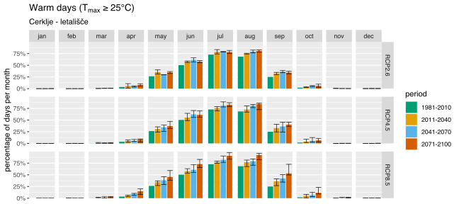<!-- --><!-- --><!-- -->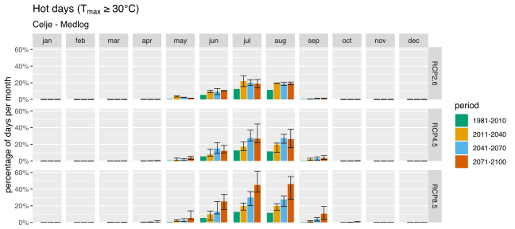<!-- --><!-- -->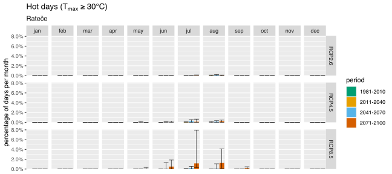<!-- --><!-- --><!-- --><!-- --><!-- --><!-- --><!-- --><!-- --><!-- -->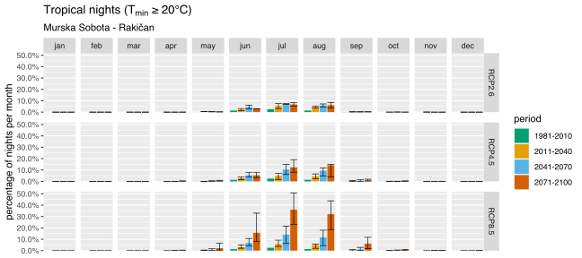<!-- --><!-- --><!-- --><!-- --><!-- --><!-- --><!-- --><!-- -->

``` r
for (var in filenames) {
    for (scen in c("RCP2.6", "RCP4.5", "RCP8.5")) {
        p <- plotdata2(alldata, var, scen)
        print(p)
    }
}
```

<!-- --><!-- --><!-- --><!-- --><!-- --><!-- --><!-- --><!-- -->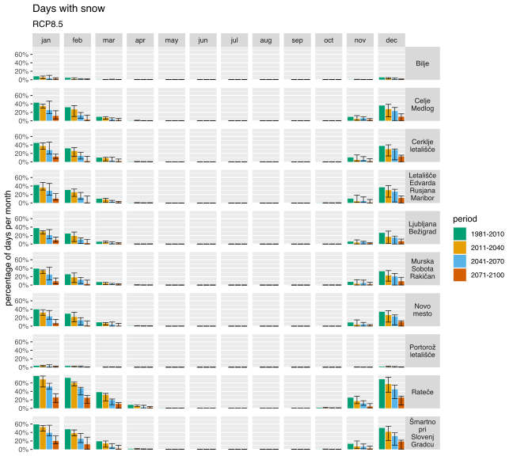<!-- --><!-- -->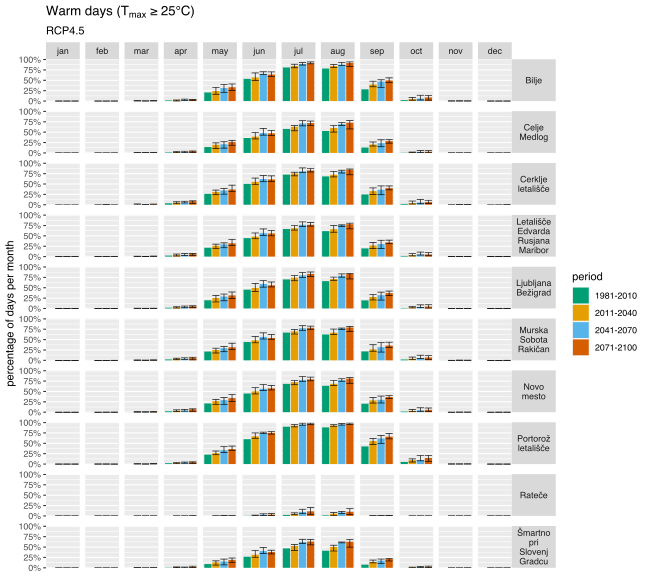<!-- --><!-- -->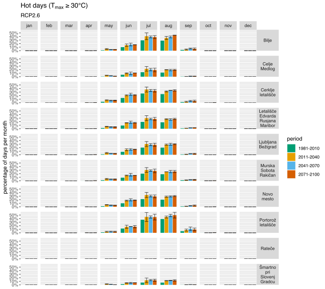<!-- --><!-- --><!-- -->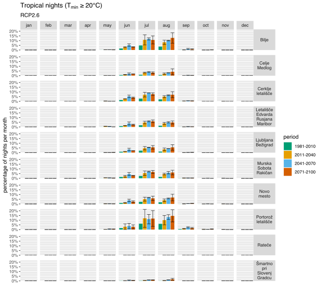<!-- --><!-- --><!-- -->

Save all the plots:

``` r
for (var in filenames) {
    for (stat_name in distinct(alldata, station)$station) {
        print(paste(var, stat_name))

        p <- plotdata(alldata, var, stat_name)
        
        ggsave(paste("arso1_", gsub(" ", "_", stat_name), "_", var, ".pdf", sep=""), p, width=9, height=4, units="in", path="../output/pdf/arso", device=cairo_pdf)
        ggsave(paste("arso1_", gsub(" ", "_", stat_name), "_", var, ".eps", sep=""), p, width=9, height=4, units="in", path="../output/eps/arso", device=cairo_ps)
        ggsave(paste("arso1_", gsub(" ", "_", stat_name), "_", var, ".svg", sep=""), p, width=9, height=4, units="in", path="../output/svg/arso")
        ggsave(paste("arso1_", gsub(" ", "_", stat_name), "_", var, ".png", sep=""), p, width=9, height=4, units="in", path="../output/png/arso", dpi=500)
    }
}
```

``` r
for (var in filenames) {
    for (scen in c("RCP2.6", "RCP4.5", "RCP8.5")) {
        print(paste(scen, var))

        p <- plotdata2(alldata, var, scen)
        
        ggsave(paste("arso2_", scen, "_", var, ".pdf", sep=""), p, width=9, height=8, units="in", path="../output/pdf/arso", device=cairo_pdf)
        ggsave(paste("arso2_", scen, "_", var, ".eps", sep=""), p, width=9, height=8, units="in", path="../output/eps/arso", device=cairo_ps)
        ggsave(paste("arso2_", scen, "_", var, ".svg", sep=""), p, width=9, height=8, units="in", path="../output/svg/arso")
        ggsave(paste("arso2_", scen, "_", var, ".png", sep=""), p, width=9, height=8, units="in", path="../output/png/arso", dpi=500)
    }
}
```
